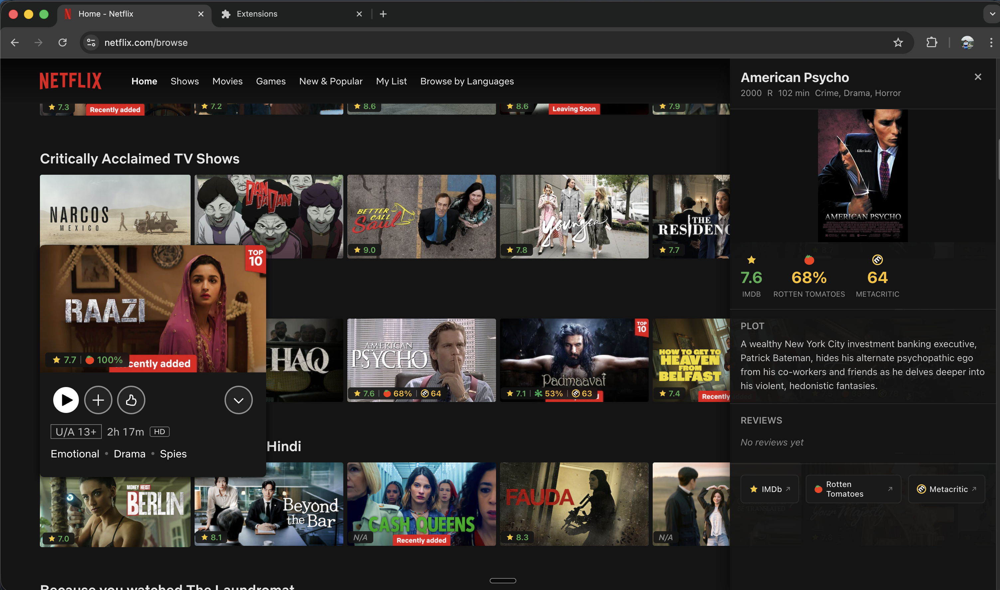
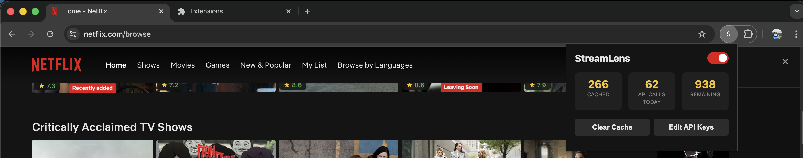

# StreamLens

Browser extension for Chrome and Safari that overlays IMDB, Rotten Tomatoes, and Metacritic ratings directly on Netflix tiles. Click any badge to open a review panel with TMDB user reviews.

Built collaboratively with [Claude Code](https://claude.ai/claude-code).

> **Heads up:** StreamLens relies on parsing Netflix's DOM structure to find and annotate title tiles. Netflix can change their markup at any time without notice, which may break badge injection or title extraction. Expect periodic maintenance when Netflix ships UI updates.

## Screenshots





## Installation

### Prerequisites

- Node.js 18+
- pnpm (`npm install -g pnpm`)
- Free API keys:
  - [OMDb API](https://www.omdbapi.com/apikey.aspx) (1,000 requests/day)
  - [TMDB API](https://www.themoviedb.org/settings/api) (free for non-commercial)

### Setup

```bash
git clone <repo-url> && cd streamlens
pnpm install
```

### Chrome

```bash
pnpm build
```

1. Open `chrome://extensions`
2. Enable **Developer mode** (top-right toggle)
3. Click **Load unpacked**
4. Select the `.output/chrome-mv3/` directory (press Cmd+Shift+. to show hidden folders)
5. Open Netflix — click the extension icon in the toolbar to enter your API keys

### Safari

Requires [Xcode](https://apps.apple.com/app/xcode/id497799835) (free from the App Store).

```bash
# One-time: point xcode-select to the full Xcode app
sudo xcode-select -s /Applications/Xcode.app/Contents/Developer

# Build, convert to Xcode project, compile, and launch
./scripts/build-safari.sh
```

After the app launches:
1. Safari → Settings → **Developer** → check **Allow unsigned extensions**
2. Safari → Settings → **Extensions** → enable **StreamLens**
3. Grant permissions for netflix.com when prompted
4. Open Netflix — click the extension icon in the toolbar to enter your API keys

> **Note:** "Allow unsigned extensions" resets every time Safari restarts. You'll need to re-enable it each session.

## Development

```bash
# Chrome dev mode with hot reload
pnpm dev

# Safari dev mode
pnpm dev:safari

# Run tests
pnpm test
```

Load the dev extension from `.output/chrome-mv3-dev/` in Chrome's extension manager.

## How It Works

1. Content script detects Netflix title tiles via MutationObserver
2. IntersectionObserver + scroll debounce triggers fetches only for visible tiles
3. Background script queries OMDb API for ratings (IMDB, RT, Metacritic)
4. Three-tier cache (memory LRU → storage.local → API) minimizes API calls
5. Badges injected via Shadow DOM to prevent CSS interference
6. Click a badge to open the review panel (TMDB reviews)

## Architecture

```
Content Script (netflix.com)          Background Service Worker
├─ MutationObserver                   ├─ Message Handler
├─ IntersectionObserver               ├─ Three-tier Cache (LRU + storage + API)
├─ Title Extractor                    ├─ OMDb API Client
├─ Badge Overlay (Shadow DOM)         ├─ TMDB Reviews Client
└─ Review Panel (Shadow DOM)          └─ In-flight Request Dedup
```

## Project Structure

```
entrypoints/
├── background/         # Service worker: API, cache, messaging
├── netflix.content/    # Content script: tiles, badges, panel
└── popup/              # Settings + first-run wizard
lib/                    # Shared types, constants, storage
tests/                  # Unit tests
scripts/                # Dev/build/test shell scripts
```
